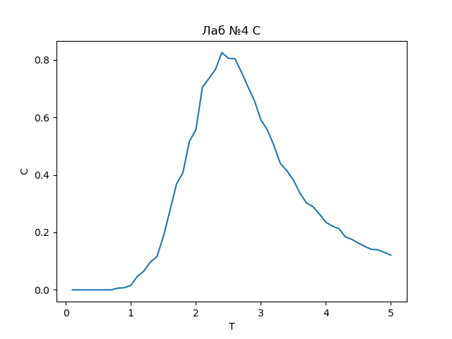

## **Лабораторная работа 4:**

#####График средней энергии

#####График квадрата средней энергии

#####График теплоёмкости

---
####Ответы на вопросы

1. Как изменилась скорость работы программы?

    > Увеличилось время работы из-за увеличения количества шагов.

1. Как алгоритм повлиял на точность результатов?

    > Точность увеличилась.
    
1. Можно ли с новым алгоритмом уменьшить число Монте-Карло шагов безпотери точности результата?
   
    > Да.