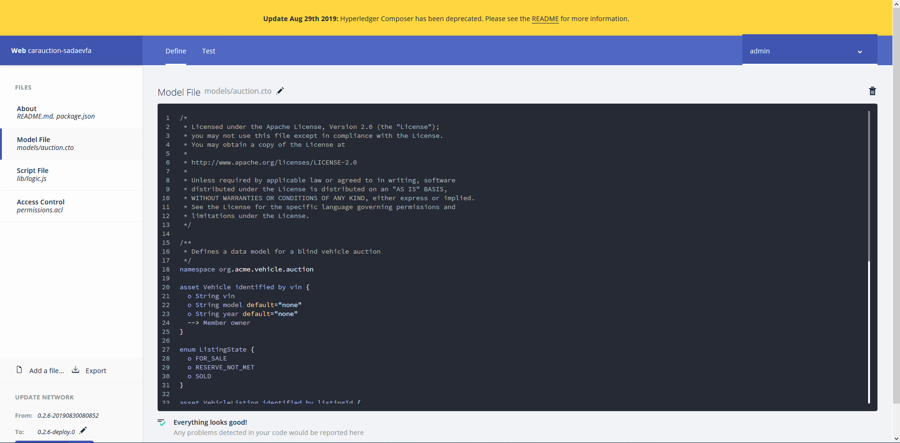
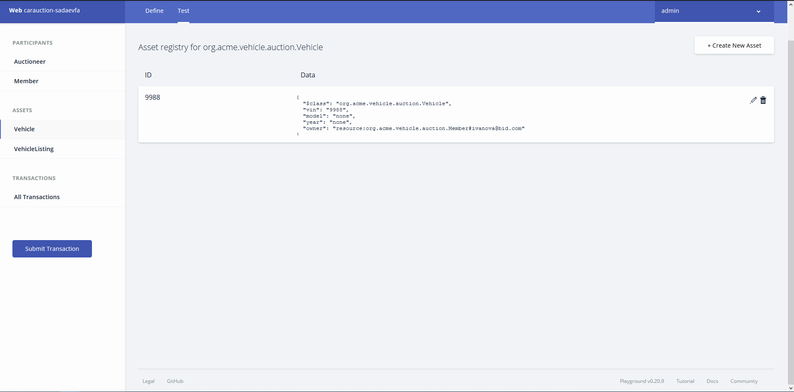
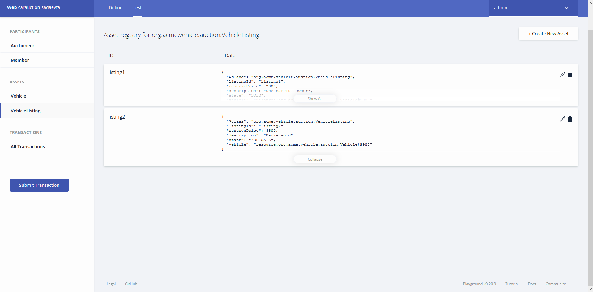
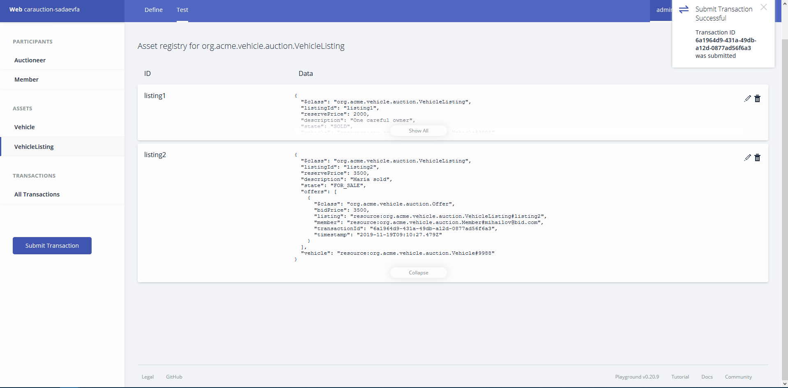
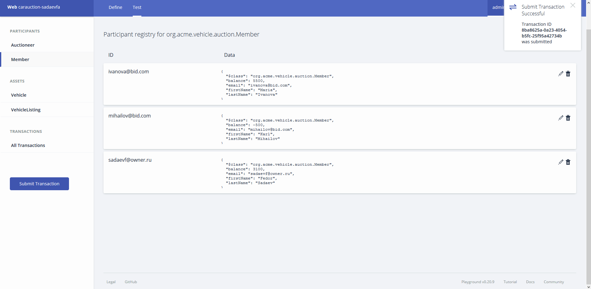
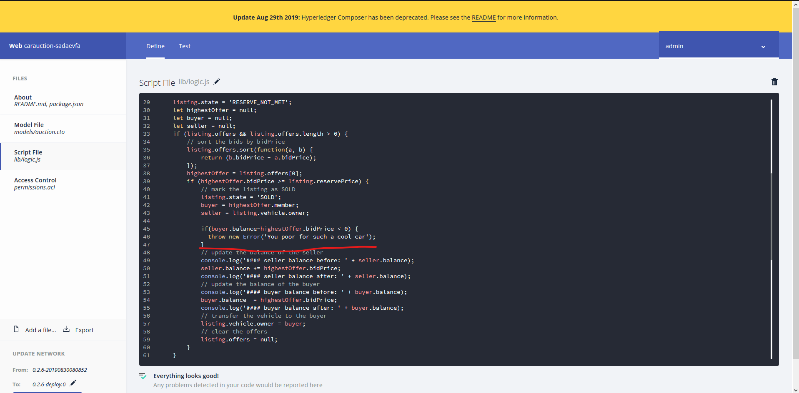
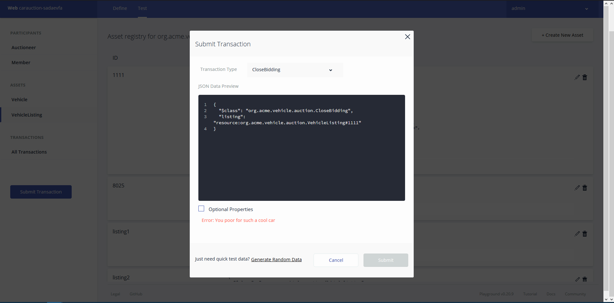

# Лабораторная работа №1

## Задание №1

1. Создали аукционную сеть.

2. Создали участников

3. Добавление авто
   1. Добавили Vehicle

   2. Выставили на продажу

4. Отправка предложении и проведение аукциона
   1. Ставка Марии

   2. Ставка Карла

   3. Закрытие ставки

   4. Проверили баланс. У Марии уменьшился баланс на 3000, а у нас увеличился.

## Задание №2

1. Новые поля.
   1. Добавили поля в модель.
   
   2. В поля авто заехали стандартные значения.
   
2. Вторая сделка.
   1. Выставили машину на продажу.
   
   2. Сделали ставку.
   
   3. Провели сделку. У Карла стал отрицательный баланс.
   
   4. Правим логику сделки.
   
   1. Повторяем 1-3 шаг. У покупателя баланс меньше ставки. Пол часа я допирал до кнопки *Deploy changes* которую не видно. В итоге ошибка вывелась.
   
   
