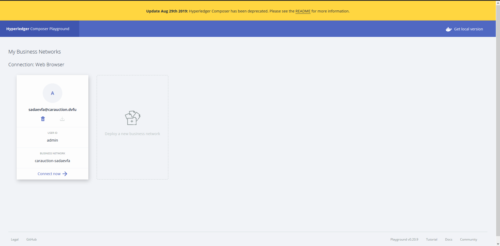
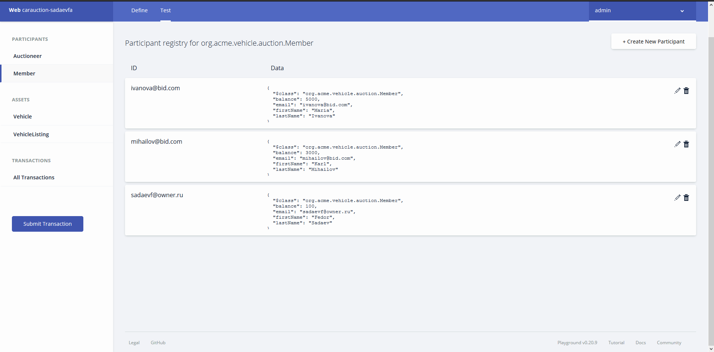
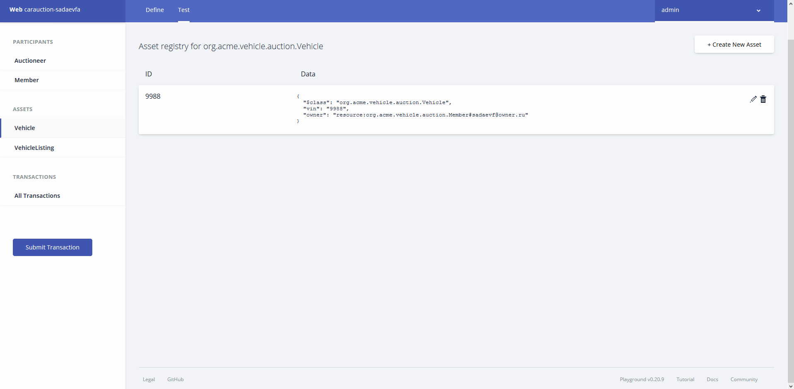
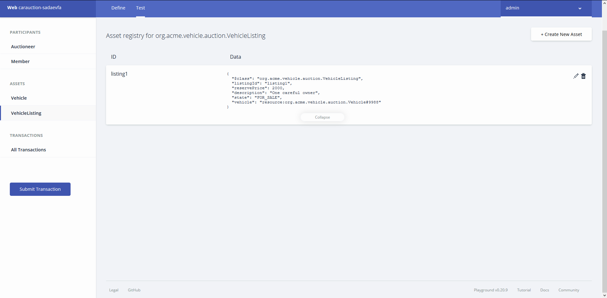
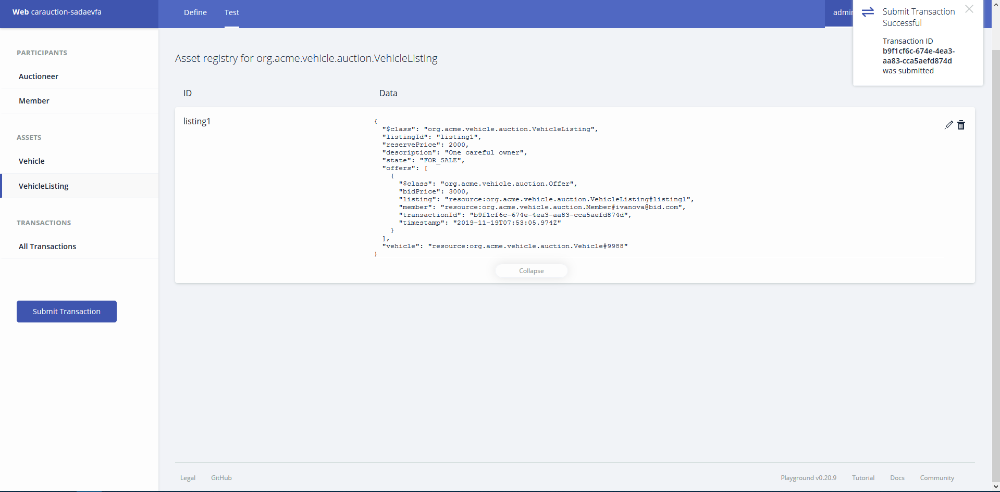
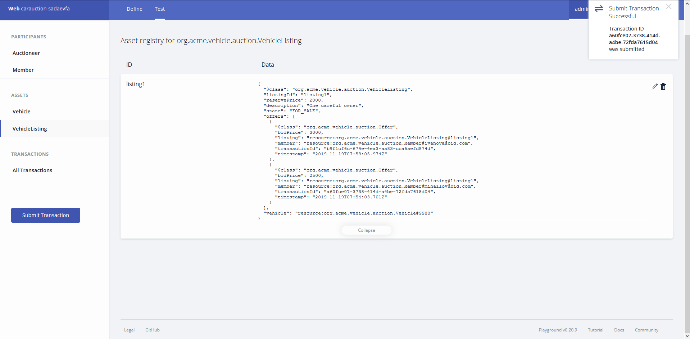
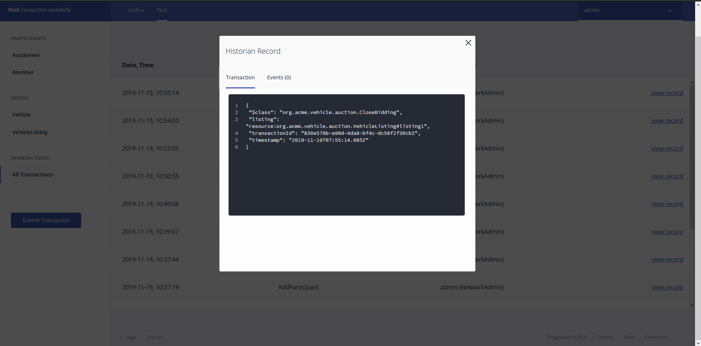
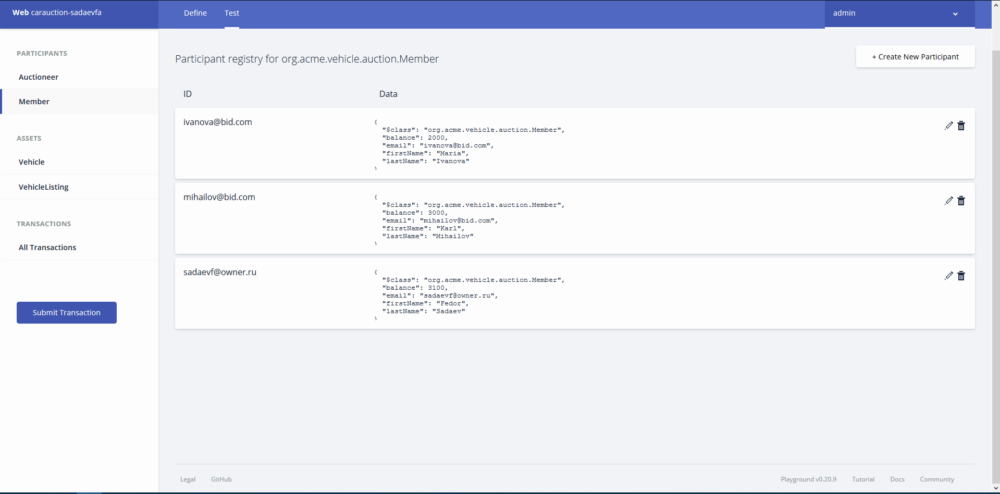

# Лабораторная работа №1

## Задание №1

1. Создали аукционную сеть.

2. Создали участников

3. Добавление авто
   1. Добавили Vehicle

   2. Выставили на продажу

4. Отправка предложении и проведение аукциона
   1. Ставка Марии

   2. Ставка Карла

   3. Закрытие ставки

   4. Проверили баланс. У Марии уменьшился баланс на 3000, а у нас увеличился.

