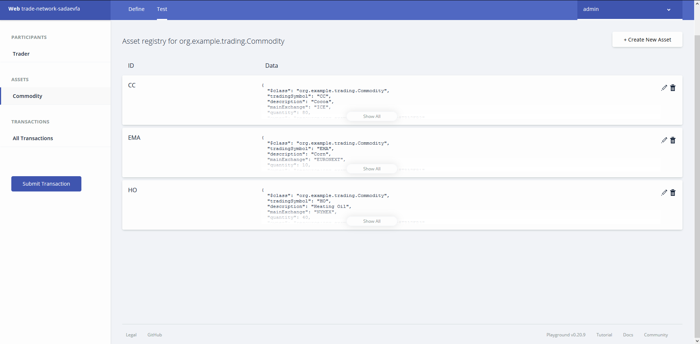
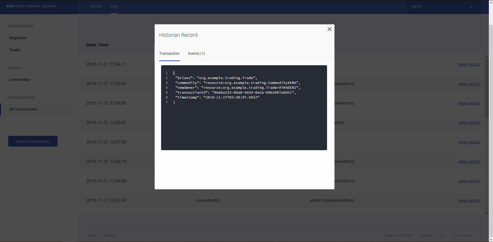

# Лабораторная работа №2

1. Создали сеть.

2. Добавили трейдеров.

3. Создали товары.

4. Создали идентификаторы дял проверки списков ACL

5. Удалили default правило.

6. Добавляем свои правила.
   1. Трейдеры могут видеть и обновлять их собственный профиль
      1. Сменили идентификатор. В тесте нет записей. Добавили правило.

      

      2. Проверяем результаты. Появилась запись первого трейдера.

      

   2. Трейдеры могут видеть и обновлять их собственные активы
      1. Добавляем правило.

      

      2. Проверяем результаты.

      

   3. Ограничить применение транзакции «Торговля» только участникам типа «Трейдер»
      1. Аналогично добавили правило. И проверяем результаты. Транзакция прошла.

      

   4. Трейдеры могут видеть только историю их собственных транзакций
      1. Аналогично добавили правило. И проверяем результаты. Админские действия не видно.

      

   5. Регулятор REGможет видеть всю историю
      1. Разрешить Регуляторам просматривать свой профиль и всю архивную деятельность, включая торговую.
         1. Добавили модель регулятора.
         2. Добавили объект регулятора.
         3. Добавили ID
         4. Добавили правила.
         5. Проверяем результат. Регулятор видит свой профиль и видит информацию транзцкции trade.
   
         
         
